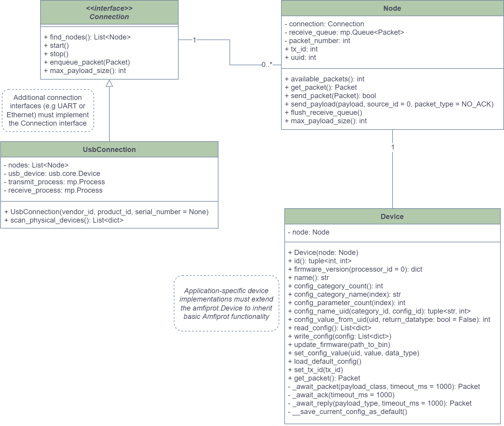
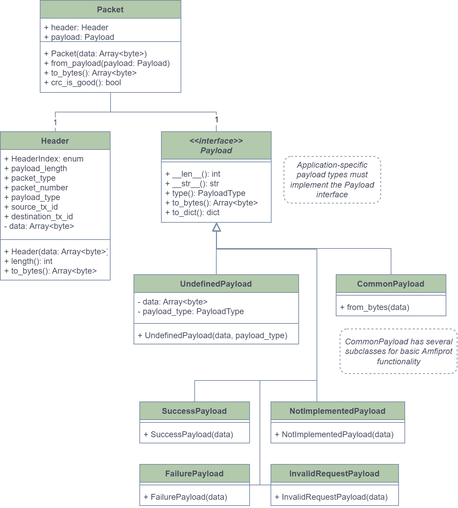

****************
Package overview
****************
The package consists of the following key components:

- Connection
- Node
- Device
- Packet (which in turn consists of a Header and a Payload)

As shown in the figure below, a :code:`Connection` interface is implemented by a concrete :code:`UsbConnection` class (more connections
will be implemented in the future). When a :code:`Connection` is created the user can search for :code:`Node`\ s on the connection.
A :code:`Node` object is injected into a :code:`Device` object at creation. The :code:`Device` object is then used to interact with the
physical device through the injected :code:`Node`.

.. _conn_diagram:

All communication is done using :code:`Packet`\ s each of which consist of a :code:`Header` and a :code:`Payload`. The :code:`Header` is
structured the same for all packets, but the :code:`Payload` can take different forms. The built-in payload types include
UndefinedPayload, CommonPayload (with several subclasses) and various "response" payloads as shown in the figure below.

.. _packet_diagram:

