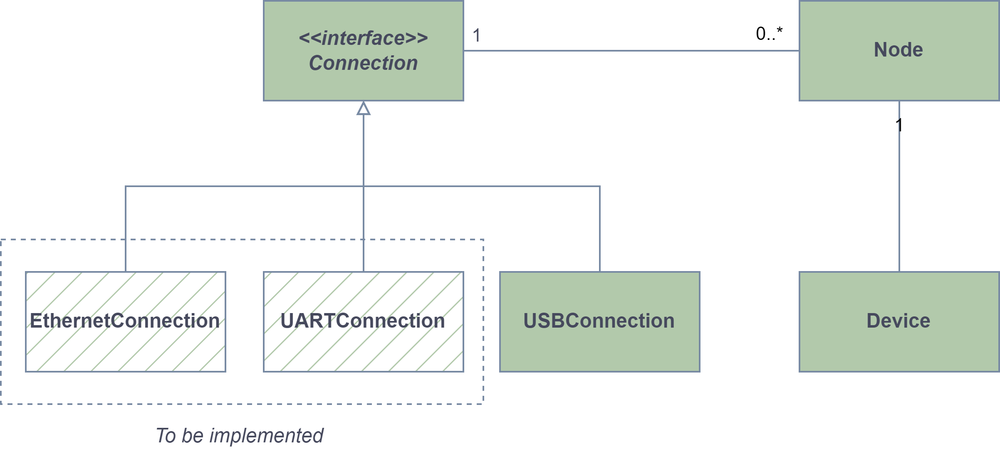
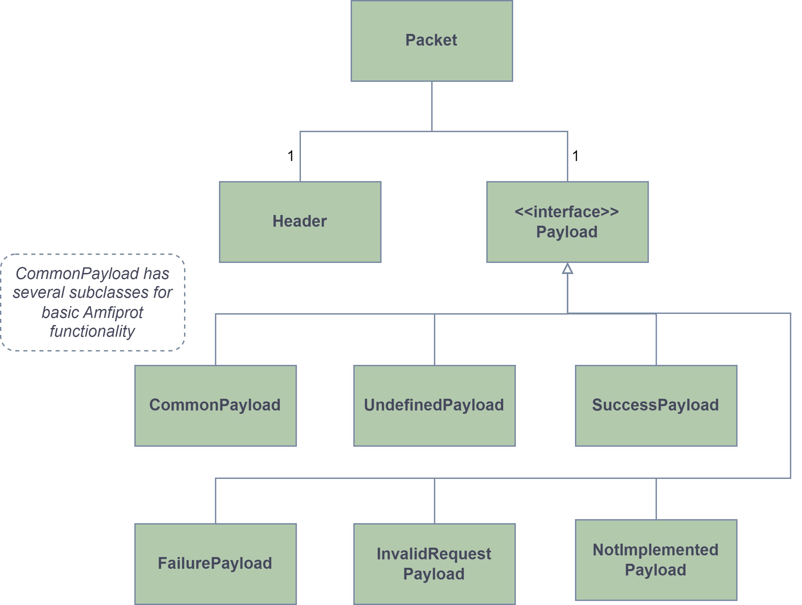

********
Overview
********
The package consists of the following key components:

- :code:`Connection`
- :code:`Node`
- :code:`Device`
- :code:`Packet` (which in turn consists of a :code:`Header` and a :code:`Payload`)

As shown in the figure below, the :code:`Connection` interface is implemented by a concrete :code:`USBConnection` class
(more connections will be implemented in the future). When a :code:`Connection` is created the user can search for
:code:`Node`\ s on the connection. A :code:`Device` is created by injecting a :code:`Node` instance into its
constructor. The :code:`Device` object is then used to interact with the physical device through the injected
:code:`Node`.

.. _conn_diagram:

All communication is done using :code:`Packet`\ s which consist of a :code:`Header` and a :code:`Payload`. The
:code:`Header` is structured the same for all packets, but the :code:`Payload` can take different forms. The built-in
payload types include :code:`UndefinedPayload`, :code:`CommonPayload` (with several subclasses) and various "response"
payloads as shown in the figure below.

.. _packet_diagram:

